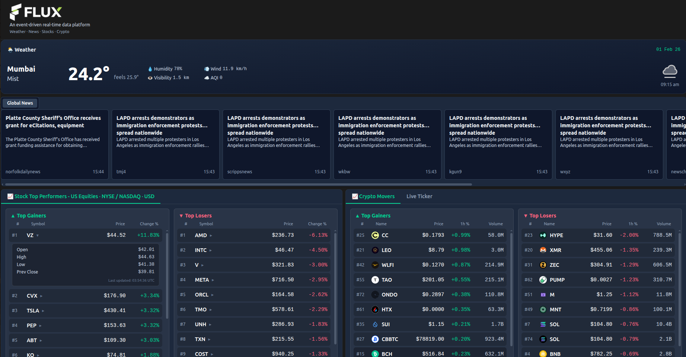
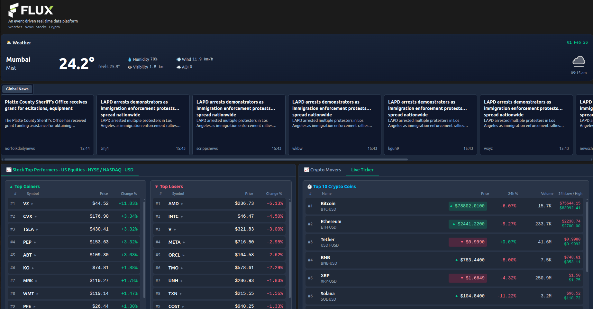
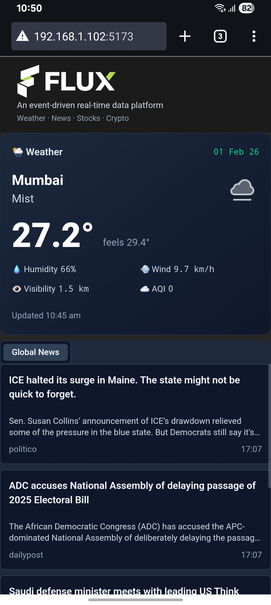
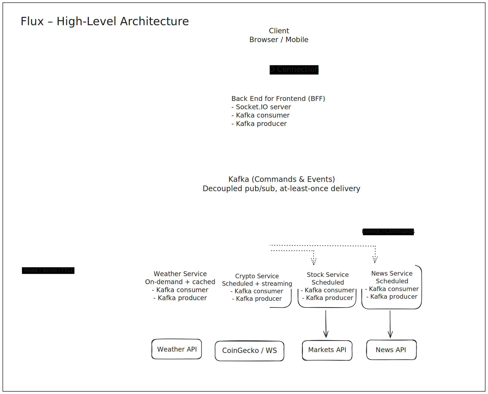

# Flux Platform

**Flux** — *An event-driven real-time data platform*

<!-- GitHub Actions badges (will activate once workflows exist and repo is on GitHub) -->


A **production-style, event-driven real-time data platform** showcasing modern **Kafka-based streaming**, **WebSocket fan-out**, and a clean **Backend-for-Frontend (BFF)** architecture.

This repository is intentionally built as a **portfolio-grade, open-source system** that mirrors how real-world, **streaming data platforms** are designed, operated, and documented.

---

## 🖥️ Live Dashboard Preview

<!-- Full desktop dashboard showing Weather, News, Stocks, Crypto -->
<p align="center">
  
</p>

<p align="center">
  
</p>


### 📱 Mobile View

<p align="center">
  
</p>


---

## ✨ What This Project Demonstrates

* Event-driven microservices using **Kafka**
* A resilient **BFF layer** for real-time fan-out
* **Socket.IO**–based client streaming
* Cache-accelerated hydration with graceful degradation
* Idempotency & deduplication patterns
* Structured logging & observability
* Self-healing Kafka connectivity
* Clean, scalable monorepo organization

The project emphasizes real-world system design concerns such as **event-driven communication, failure handling, and scalability**.

---

## 🧠 High-Level Architecture

```
┌──────────────────────┐
│        Client        │
│  Browser / Mobile    │
└─────────▲────────────┘
          │ Socket.IO (real-time)
┌─────────┴──────────────┐
│   Backend-for-Frontend │
│          (BFF)         │
│  - Socket.IO Server    │
│  - Kafka Producer      │
│  - Kafka Consumer      │
│  - Cache-aware fanout  │
└─────────▲──────────────┘
          │ Commands & Events
┌─────────┴────────────┐
│        Kafka         │
│  Pub/Sub Message Bus │
│  (at-least-once)     │
└─────────▲────────────┘
          │
┌─────────┴────────────────────────────────────┐
│               Domain Services                │
│                                              │
│  weather-service  (on-demand + cached)       │
│  crypto-service   (scheduled + streaming)    │
│  stock-service    (scheduled)                │
│  news-service     (scheduled)                │
│                                              │
│  Each service:                               │
│  - Kafka producer & consumer                 │
│  - Owns external API integration             │
└──────────────────────────────────────────────┘

┌──────────────────────────┐
│      Shared Cache        │
│   (Valkey / Redis)       │
│  - Hydration snapshots   │
│  - Deduplication windows │
│  - Non-critical (TTL)    │
│  Used by: BFF + Services │
└──────────────────────────┘

```

---

<p align="center">
  
</p>

## 🎯 Why a Backend-for-Frontend (BFF)?

* Prevents frontend → Kafka coupling
* Centralizes real-time logic (rooms, fan-out, hydration)
* Enables protocol translation (Kafka ⇄ WebSockets)
* Allows independent evolution of services & UI
* Simplifies client logic and error handling

---

## 🖥️ Frontend Architecture (At a Glance)

The frontend is intentionally **thin and event-driven**:

* One persistent Socket.IO connection
* Explicit user readiness lifecycle
* Feature-isolated hooks (weather, news, stocks, crypto)
* Stateless UI components
* No global state library
* No direct service or Kafka access

See **`frontend/ARCHITECTURE.md`** for details.

---

## 📦 Monorepo Structure

```
root/
│
├── frontend/        # React + Socket.IO client
│
├── server/          # BFF (WebSockets + Kafka + Cache)
│   ├── modules/     # Kafka consumers → socket emitters
│   ├── cache/       # Valkey integration + graceful fallback
│   ├── constants/   # Topics, rooms, cache keys
│   └── server.ts    # Bootstrap & lifecycle
│
├── services/        # Independent domain services
│   ├── weather-service/
│   ├── crypto-service/
│   ├── stock-service/
│   └── news-service/
│
├── docs/            # Architecture & design docs
└── docker-compose.yml
```

---

## 🔁 Example Data Flows

### 🌦 Weather

1. Client sends `userLocationUpdate`
2. BFF deduplicates location events (Valkey-backed)
3. BFF publishes `weather.service.command.fetch`
4. Weather service fetches & emits update
5. BFF fans out to `weather.{city}` room

---

### 💹 Crypto

**Services publish:**

* `crypto.movers.event.updated`
* `crypto.topcoins.event.updated`
* `crypto.ticker.event.updated`

**BFF responsibilities:**

* Cache snapshots with short TTLs
* Emit to `crypto.global`
* Hydrate reconnecting clients from cache

---

### 📰 News

* News service publishes `news.service.event.updated`
* BFF caches latest articles
* Emits to `news.global`
* New clients receive cached news immediately

---

## ⚡ Caching Strategy (Valkey / Redis)

* Cache is **non-critical**
* Used for:

  * Fast client hydration
  * Deduplication windows
  * Short-lived snapshots

If cache fails:

* Warning is logged
* System continues in degraded mode

See **`docs/caching-strategy.md`**.

---

## 🧪 Testing Philosophy

This project prioritizes **meaningful coverage over raw percentages**:

* Unit tests for pure logic
* Integration tests at service boundaries
* Avoidance of over-mocking
* No artificial global coverage number

Coverage is generated **per package**, not flattened across the monorepo.

> [!TIP] 
> Run npm run test:coverage per package for targeted insights—avoid monorepo-wide % as it masks service-specific gaps.

See **[Testing Philosophy & Strategy](docs/testing.md)**.


---

## 🛠️ Local Environment Setup (Docker & Node.js)

This section walks you through installing **Docker** and **Node.js** on **Windows**, **macOS**, and **Linux**. These are the only prerequisites required to run Flux locally.

---

## ✅ Prerequisites Overview

You need:

* **Docker** (with Docker Compose)
* **Node.js 20+** (LTS recommended)

> [!IMPORTANT]
> Docker is mandatory. Flux relies on Docker Compose to run Kafka, Valkey, services, BFF, and frontend together.

---

## 🪟 Windows Setup

### 1️⃣ Install Docker Desktop (Windows)

1. Download Docker Desktop:
   [https://www.docker.com/products/docker-desktop/](https://www.docker.com/products/docker-desktop/)

2. Run the installer

3. **Enable WSL 2** when prompted (recommended)

4. Restart your system

> [!TIP]
> Enable WSL 2 during Docker Desktop install for 20-30% better performance on resource-constrained machines.

After installation, verify:

```bash
docker --version
docker compose version
```

If both commands work, Docker is ready.

---

### 2️⃣ Install Node.js (Windows)

1. Download Node.js **LTS (20+)**:
   [https://nodejs.org/](https://nodejs.org/)
2. Run the installer (default options are fine)

Verify:

```bash
node -v
npm -v
```

---

## 🍎 macOS Setup

### 1️⃣ Install Docker Desktop (macOS)

1. Download Docker Desktop:
   [https://www.docker.com/products/docker-desktop/](https://www.docker.com/products/docker-desktop/)
2. Choose the correct build:

   * **Apple Silicon (M1/M2/M3)** or
   * **Intel**
3. Install and launch Docker

Verify:

```bash
docker --version
docker compose version
```

---

### 2️⃣ Install Node.js (macOS)

#### Option A: Using Homebrew (Recommended)

```bash
brew install node@20
```

Ensure Node 20 is active:

```bash
node -v
```

#### Option B: Official Installer

Download from:
[https://nodejs.org/](https://nodejs.org/)

---

## 🐧 Linux Setup

### 1️⃣ Install Docker (Linux)

#### Ubuntu / Debian

```bash
sudo apt update
sudo apt install -y docker.io docker-compose-plugin
sudo systemctl enable docker
sudo systemctl start docker
```

(Optional) Run Docker without sudo:

```bash
sudo usermod -aG docker $USER
newgrp docker
```

> [!CAUTION]
> Skipping `usermod -aG docker $USER` leads to repeated sudo prompts; log out/in after adding your user to the group.

Verify:

```bash
docker --version
docker compose version
```

---

#### Arch Linux

```bash
sudo pacman -S docker docker-compose
sudo systemctl enable docker
sudo systemctl start docker
```

---

### 2️⃣ Install Node.js (Linux)

#### Recommended: Node Version Manager (nvm)

```bash
curl -fsSL https://raw.githubusercontent.com/nvm-sh/nvm/v0.39.7/install.sh | bash
source ~/.bashrc
nvm install 20
nvm use 20
```

Verify:

```bash
node -v
npm -v
```

---

## 🔍 Verify Everything

Before running Flux, confirm:

```bash
docker --version
docker compose version
node -v
```

Expected:

* Docker installed and running
* Docker Compose available
* Node.js **v20+**

---

## 🔐 Secrets & API Keys Setup (First-Time Only)

Flux uses **Docker secrets** for sensitive values like cache passwords and external API keys.
Before running the system for the first time, you must create a local `secrets/` directory and populate the required files.

> [!IMPORTANT]
> The application expects **plain-text files** mounted as Docker secrets. Missing files will cause dependent services to fail at startup.

---

### 1️⃣ Create the `secrets/` Directory

From the project root:

```bash
mkdir secrets
```

> [!NOTE]
> The `secrets/` directory is intentionally **not committed** to Git and should remain local only.

---

### 2️⃣ Create Required Secret Files

Create the following files inside the `secrets/` directory.

**Linux / macOS (one command):**

```bash
mkdir -p secrets && touch secrets/valkey_pass.txt secrets/weather_api_key.txt secrets/newsdata_api_key.txt secrets/finnhub_api_key.txt
```

**Windows (PowerShell – one command):**

```powershell
mkdir secrets -Force | Out-Null; "valkey_pass.txt","weather_api_key.txt","newsdata_api_key.txt","finnhub_api_key.txt" | ForEach-Object { New-Item -Path "secrets\$_" -ItemType File -Force }
```

Each file should contain **only the raw value**, with no quotes and no extra spaces.

Example:

```text
my-super-secret-password
```

> [!TIP]
> Use a strong password for `valkey_pass.txt` even in local setups—it mirrors production-grade practices.

---

### 3️⃣ API Keys Reference Table

| Secret / File Name     | API Source (Free Tier)                                           | Used By Service    | Where It Is Read From           |
| ---------------------- | ---------------------------------------------------------------- | ------------------ | ------------------------------- |
| `valkey_pass.txt`      | — (user-defined password)                                        | All services + BFF | `/run/secrets/valkey_pass`      |
| `weather_api_key.txt`  | [https://openweathermap.org/api](https://openweathermap.org/api) | `weather-service`  | `/run/secrets/weather_api_key`  |
| `newsdata_api_key.txt` | [https://newsdata.io](https://newsdata.io)                       | `news-service`     | `/run/secrets/newsdata_api_key` |
| `finnhub_api_key.txt`  | [https://finnhub.io](https://finnhub.io)                         | `stock-service`    | `/run/secrets/finnhub_api_key`  |

> [!IMPORTANT]
> Never commit real secrets or API keys to GitHub. The `secrets/` directory should always stay local.

> [!NOTE]
> If an API key is missing, the corresponding service will start but emit **no live data** and log warnings.

---

## 🚀 Running Flux Locally

From the project root:

```bash
docker-compose up --build
```

> [!NOTE]
> First build takes 5-10 minutes (downloads Kafka images, builds services). Subsequent runs are <1 minute.

This will start:

* Kafka
* Valkey (Redis-compatible cache)
* All domain services
* Backend-for-Frontend (BFF)
* Frontend dashboard

Once running, open the frontend in your browser:

```text
http://localhost:5173
```

---

## 🧯 Common Issues

**Docker not running**

* Ensure Docker Desktop is started

**Permission denied (Linux)**

* Make sure your user is in the `docker` group

**Port conflicts**

* Stop other Kafka / Redis instances
* Or update ports in `docker-compose.yml`

> [!WARNING]
> Port conflicts (e.g., existing Redis on 6379)? Update `docker-compose.yml` ports before `up --build` to avoid data corruption.

---

If you get stuck, check logs with:

```bash
docker-compose logs -f
```

You're now ready to explore Flux 🚀

---

## 📚 Documentation Index

* [Architecture Overview](docs/architecture.md)
* [Kafka Topics & Events](docs/kafka-topics.md)
* [Socket.IO Event Contracts](docs/socket-events.md)
* [Caching Strategy (Valkey / Redis)](docs/caching-strategy.md)
* [Testing Philosophy & Strategy](docs/testing.md)
* [Frontend Architecture](frontend/ARCHITECTURE.md)

---

## 📜 License

MIT License.

---

## 🙌 Why Flux Exists

This project exists to demonstrate:

* Real-world backend architecture
* Streaming system design
* Production-grade Node.js patterns
* Clear documentation and reasoning

If you’re reviewing this as a recruiter or engineer, a good starting point is the **[BFF architecture and design](server/README.md)**.
